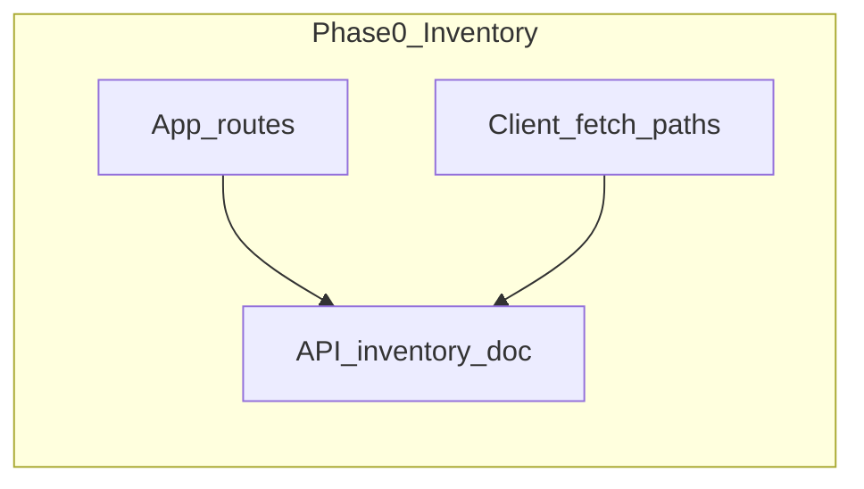

# Full application review (code, docs, security, tests)

**Status:** Proposed  
**Type:** Process / hardening — phased review, not a single feature.

## Goal and non-goals

**Goals:**

- Code cleanup (client, server, shared).
- Docs cleanup and alignment with behavior.
- Frontend optimization and abstractions where they reduce risk or complexity.
- Backend optimization and abstractions (queries, transactions, observability).
- Find functionality holes (journeys and edge cases).
- Find missing tests and close P0/P1 gaps.
- Security, privacy, a11y, supply chain, data lifecycle, telemetry, and CI/release hygiene.

**Non-goals:**

- Rewriting the app in one pass; this is **evidence-based phases** with a findings log.
- Building full i18n or legal policies unless findings require it.

## Purpose and output

Run a **phased, evidence-based review** (not a single giant PR). Deliverables per phase:

- **Findings log** (severity: P0–P3, area, file refs, suggested fix or “defer”).
- **Short delta list** for [CHANGELOG.md](../CHANGELOG.md) only when you act on findings.
- **Living progress:** [docs/plans/full-app-review-2026.md](../plans/full-app-review-2026.md) (slice status, parity notes, findings log).

Use repo gates as the **definition of “green”** after changes: [docs/development-workflow.md](../development-workflow.md) (lint, tsc, test, build; E2E where applicable).

---

## 1. Baseline and inventory (half day)

- **Map the system**: skim [docs/architecture.md](../architecture.md), [docs/project-structure.md](../project-structure.md), [docs/data-flow.md](../data-flow.md) (if present).
- **API vs client parity**: extend or refresh [docs/plans/backend-db-review-inventory.md](../plans/backend-db-review-inventory.md) — grep `server/routes` + `client/src` for `/api/` usage; flag **orphan endpoints**, **client calls with no server route**, and **auth-gated** vs **public** assumptions.
- **Feature surface**: routes in `client/src/App.tsx` vs documented flows in [docs/README.md](../README.md) (Search/Reader/Saved/Support/Admin/OIDC, etc.).
- **Dependency / risk snapshot**: note major stacks (React 19, RR7, Drizzle, Vitest, Playwright if used) and any rollout flags ([docs/configuration.md](../configuration.md), `VITE_*`).

---

## 2. Code cleanup (ongoing, file-driven)

**Client**

- **Dead code**: unused exports, orphaned components, duplicate helpers; ESLint unused rules are already strict—triage any suppressed disables (`eslint-disable`).
- **Consistency**: naming, folder placement per [docs/styleguide/frontend-patterns.md](../styleguide/frontend-patterns.md); large pages (e.g. `client/src/pages/BibleReaderPage.tsx`, `client/src/pages/SearchPage.tsx`) for extractable hooks/UI.
- **Copy and a11y**: headings/labels vs behavior; focus management on modals (shared primitives under `client/src/components/ui/`).

**Server**

- **Layering**: controllers thin, services own DB/business rules per [docs/styleguide/backend-patterns.md](../styleguide/backend-patterns.md).
- **Error paths**: `asyncHandler`, Zod, envelope consistency; map surprising **4xx/5xx** to user-safe messages where needed.
- **TODO/FIXME/HACK**: repo-wide grep with triage.

**Shared**

- `shared/` contracts vs `server/db/schema.ts` / `database/schema.sql` drift (types, enums, validation).

---

## 3. Docs cleanup

- **Index accuracy**: [docs/README.md](../README.md) vs actual files; remove or archive stale plans.
- **Styleguides vs code**: [docs/styleguide/](../styleguide/) (especially [frontend-patterns.md](../styleguide/frontend-patterns.md), [backend-patterns.md](../styleguide/backend-patterns.md), [database-constraints.md](../styleguide/database-constraints.md), [backend-observability-security.md](../styleguide/backend-observability-security.md)) — flag sections that no longer match behavior.
- **Operational truth**: [docs/configuration.md](../configuration.md), [docs/deployment/README.md](../deployment/README.md), env examples under `server/.env.example` / `client/.env.example`.
- **Domain docs**: feature-specific docs (e.g. [docs/verse-search-save.md](../verse-search-save.md), reader/search/saved flows) vs current UX.
- **Testing doc**: locate or add a single **testing** entry point (if missing at root, consolidate pointers from README + workflow doc) so “how to run integration/IDOR/E2E” is one hop.

---

## 4. Frontend — optimization and abstractions

- **Data loading**: repeated `useEffect` + fetch patterns → align with established hooks (e.g. `useAbortableAsyncEffect` if documented in styleguide); avoid duplicate request races on route changes.
- **State**: local vs URL (`client/src/features/reader/useReaderChapterRouteState.ts` pattern), session/route snapshot patterns (`client/src/lib/route-session-state.ts`).
- **Bundle**: lazy routes already in App; audit heavy imports (charts, MDX, large deps) and dynamic import opportunities.
- **Rendering**: memoization only where measured or clearly hot; list virtualization only if lists are large and proven slow.
- **Network**: API client centralization (`client/src/lib`), credentials/error handling consistency.

---

## 5. Backend — optimization and abstractions

- **Query efficiency**: N+1 in services (emotions, saved scriptures, reader chapter, search FTS); missing indexes → cross-check [docs/styleguide/database-constraints.md](../styleguide/database-constraints.md).
- **Transactions**: multi-step writes (saved batch, reader state, scripture flows) — document semantics and retry expectations.
- **Caching** (if any): HTTP headers, static assets; avoid caching authenticated JSON incorrectly.
- **Observability**: structured logs, PII in logs audit per [docs/styleguide/backend-observability-security.md](../styleguide/backend-observability-security.md); rate limits and health/ready for deploy targets.

---

## 6. Functionality holes (product + engineering)

Use a **matrix**: user journey × edge cases.

| Area    | Journeys to walk                                                            |
| ------- | --------------------------------------------------------------------------- |
| Auth    | Login, logout, session expiry, OIDC if enabled, guest/device flows          |
| Support | Emotion → scriptures → full context → reader handoff                        |
| Search  | Guided / reference / keyword, save, open in reader                          |
| Reader  | Book/chapter/translation, verse deep links, bookmark, options, back/forward |
| Saved   | List, chapter scope, notes, translation change, delete                      |
| Admin   | If used in prod: authz, pagination, audit events                            |

Explicitly test: **offline/slow network**, **invalid deep links**, **empty DB rows** (translations), **concurrent tabs**, **large payloads**.

---

## 7. Missing tests

- **Coverage gaps**: Vitest coverage thresholds exist in client/server configs — run `pnpm run test` / `test:coverage` and list modules under threshold.
- **Server**: route tests (`server/routes/`), service unit tests with mocked DB; integration tests that need Postgres (pattern already in inventory doc).
- **Client**: MSW handlers vs real API shapes; critical pages (Reader, Search, Saved) RTL tests; regression tests for recent bug classes (URL/state sync).
- **E2E**: if Playwright (or similar) exists, map smoke paths to the journey matrix; add tests for P0 holes only.

---

## 8. Security, privacy, and trust (often under-scoped)

Cross-check [docs/styleguide/backend-observability-security.md](../styleguide/backend-observability-security.md) and [docs/security-notes.md](../security-notes.md) (if present).

- **Authorization**: every mutating and sensitive **GET** route — who can call it (user, admin, device, public)? Spot-check IDOR patterns (saved scriptures, reader state, admin).
- **Session / cookies / OIDC**: cookie flags (`Secure`, `SameSite`), callback and logout flows, token in URL fragment (if split deploy) — align with [docs/deployment/auth0-setup.md](../deployment/auth0-setup.md) when OIDC is on.
- **Browser-facing risks**: XSS sinks (MDX, `dangerouslySetInnerHTML`, user-generated notes/names); CSP if used.
- **Secrets**: no committed secrets; `.env.example` parity; CI secrets vs local docs.
- **Audit / compliance hooks**: `auth_audit_events` and admin surfaces — are sensitive actions logged consistently?

---

## 9. Accessibility, i18n, and perceived performance

- **Beyond “labels exist”**: keyboard order, focus return from modals, reader-specific comfort (motion, contrast) vs `docs/plans/` reader work; run or extend existing axe/E2E a11y specs if present.
- **i18n readiness** (if you might localize later): hard-coded strings in hot paths, date/number formatting, RTL risks — flag “extract later” debt without building i18n now.
- **Perf spot-check**: Lighthouse or Web Vitals on **Support home**, **Reader**, **Search** (LCP, INP, CLS); heavy routes (MDX tutorial, large lists) — document baselines, not premature optimization.

---

## 10. Supply chain, data lifecycle, and telemetry

- **Dependencies**: `pnpm audit` (and CI schedule), outdated majors, `onlyBuiltDependencies` / lockfile policy; note risky native deps.
- **Data lifecycle**: user-visible delete/export expectations (saved items, notes, account); retention language in privacy/about if you collect PII.
- **Migrations**: rollback story (forward-only vs backups); seed vs prod data drift.
- **Telemetry**: inventory `trackEvent` (or equivalent) payloads vs “what we say we collect” in docs; avoid PII in events.

---

## 11. CI/CD and release hygiene

- **Workflow parity**: PR checks vs [docs/development-workflow.md](../development-workflow.md) local gate; optional scheduled jobs (audit).
- **Branch protection / deploy**: who can ship; smoke after deploy ([docs/deployment/README.md](../deployment/README.md)) — documented and still accurate.

---

## 12. Suggested execution order (minimize thrash)

1. Inventory + functionality matrix (Sections 1 + 6) — produces the backlog.
2. **Security / authz / IDOR** (Section 8) + P0 correctness — then tests for those paths (Section 7).
3. Backend query/transaction review (Section 5) + DB docs.
4. Frontend abstractions and perf (Section 4).
5. **A11y + telemetry + deps** (Sections 9–10) — usually parallelizable.
6. Code cleanup sweep (Section 2) + docs alignment (Section 3).
7. CI/release sanity (Section 11) before calling the review “closed.”

---

## 13. What “done” looks like

- Backlog triaged with owners/effort; P0/P1 empty or time-boxed.
- Styleguides and configuration docs match production behavior.
- CI parity commands pass; coverage or test list explicitly covers P0 journeys.
- No known **silent** client/server contract drift for `/api/*`.
- **Security**: no unowned sensitive routes; secrets and cookie/OIDC behavior documented.
- **Trust**: telemetry and data practices match docs (or docs updated).

---

## Workstream checklist (optional tracking)

Use this in PRs or in `docs/plans/full-app-review-*.md` as you complete work.

- [ ] Baseline: API/client/route inventory + `App.tsx` surface
- [ ] Journey matrix (Support / Search / Reader / Saved / Auth / Admin) + edge cases
- [ ] Code cleanup: client, server, shared
- [ ] Docs audit: index, styleguides, config/deploy, testing entry
- [ ] Frontend: data loading, state/URL, bundle, network consistency
- [ ] Backend: queries, indexes, transactions, observability
- [ ] Test gap analysis + P0/P1 coverage
- [ ] Findings log (P0–P3) + living progress doc
- [ ] Security / privacy / authz / IDOR pass
- [ ] A11y + i18n debt + perf baselines
- [ ] Dependencies / data lifecycle / telemetry vs docs
- [ ] CI/CD and release hygiene

## Related documents

- [docs/plans/backend-db-review-inventory.md](../plans/backend-db-review-inventory.md)
- [docs/plans/backend-db-review.md](../plans/backend-db-review.md)
- [docs/styleguide/README.md](../styleguide/README.md)
