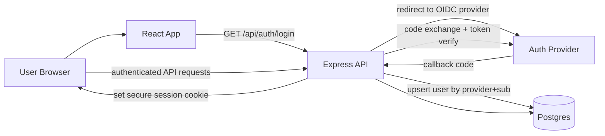

# Proposal: OAuth Email Login with Minimal PII

## Goal

Add account-based login so users can sign in with email/OAuth while storing the least possible personally identifiable information (PII).

## Non-Goals

- Building a custom password auth system
- Storing full user profiles
- Adding social graph, messaging, or advanced account settings in this phase

## Current Stack Context

- Frontend: React + Vite (`client`)
- Backend: Express 5 (`server`)
- Database: PostgreSQL + Drizzle (`server/db/schema.ts`, `database/schema.sql`)
- Existing user-ish state: anonymous `deviceId` used for saved scripture items
- Existing API style: envelope responses from server helpers

## Recommendation

Use **OIDC Authorization Code Flow with PKCE** via a managed identity provider, and map identity to an internal pseudonymous user ID.

Recommended providers for this stack:

1. **Auth0** (strong docs, very common OIDC setup)
2. **Clerk** (fast DX, batteries-included UI)
3. **WorkOS AuthKit** (good enterprise path later)

For minimal PII and flexibility with your current backend patterns, start with **Auth0 + backend session cookie**.

## Privacy Model (Minimal PII)

Store only:

- internal `userId` (UUID)
- provider key (e.g., `auth0`)
- provider subject (`sub` claim; opaque stable identifier)
- timestamps

Do not store by default:

- email address
- display name
- avatar
- OAuth access token/refresh token in app DB

Notes:

- The provider can still use email for authentication UX.
- Your app can avoid persisting that email unless product requirements demand it later.

## Proposed Architecture

## Concrete Implementation Plan

### 1) Data Model Changes

Add tables:

- `users`
  - `userId` UUID PK
  - `createdAt`, `updatedAt`
- `auth_accounts`
  - `authAccountId` serial/UUID PK
  - `userId` FK -> `users`
  - `provider` text (e.g., `auth0`)
  - `providerSubject` text (`sub`)
  - unique `(provider, providerSubject)`
  - timestamps

Modify existing table:

- `saved_scripture_items`
  - add nullable `ownerUserId` FK -> `users`
  - keep `deviceId` during migration window
  - add index on `ownerUserId`
  - adapt unique constraints to support user-scoped uniqueness:
    - unique on `(ownerUserId, translation, book, chapter, verseStart, verseEnd)` when `ownerUserId` present
    - keep device-scoped uniqueness for anonymous path while both modes coexist

### 2) Server Auth Endpoints

Add controller/routes:

- `GET /api/auth/login`
  - starts OIDC flow, sets short-lived state/nonce verifier (server-side or signed cookie)
- `GET /api/auth/callback`
  - exchanges authorization code
  - verifies ID token (`iss`, `aud`, `exp`, `nonce`)
  - reads `sub`
  - upserts local user+auth account
  - sets app session cookie
  - redirects to frontend app route
- `POST /api/auth/logout`
  - clears app session cookie (and optionally provider logout redirect)
- `GET /api/auth/me`
  - returns minimal account state:
    - `{ isAuthenticated: true, userId: "..." }`
    - no email by default

### 3) Session Strategy

Use secure HTTP-only cookie session:

- `HttpOnly=true`
- `Secure=true` in production
- `SameSite=Lax` (or `None` if cross-site deployment requires it)
- short TTL + rotation policy

Session payload should be minimal:

- `sessionId`
- internal `userId`
- issued/expiry metadata

Do not put OIDC tokens in frontend-accessible storage.

### 4) Auth Middleware

Add `requireUser` middleware for protected APIs.

Apply to:

- `GET /api/saved-scriptures`
- `POST /api/saved-scriptures`
- `DELETE /api/saved-scriptures/:savedId`

Transitional compatibility:

- Option A: Keep anonymous mode + authenticated mode side-by-side
- Option B: Require login for saves immediately

Recommended: **Option A first**, then evaluate usage and migrate to Option B later.

### 5) Saved Data Migration Logic

On first authenticated request to saves:

- if `x-device-id` present and user has no migrated rows:
  - move/merge device rows into user-owned rows
  - resolve duplicates via unique constraints (ignore conflicts)
  - mark migration complete for that user/device

This gives a smooth UX and preserves existing user data.

### 6) Frontend Changes

Add auth state and actions:

- `GET /api/auth/me` on app boot
- Login button -> `/api/auth/login`
- Logout action -> `POST /api/auth/logout`

Update Saved/Search pages:

- show sign-in prompt if user not authenticated (if route becomes protected)
- keep save buttons disabled/loading correctly during auth transition

### 7) Environment Variables

Server (`server/.env` and `.env.example`):

- `AUTH_PROVIDER=auth0`
- `AUTH_ISSUER=https://<tenant>.auth0.com/`
- `AUTH_CLIENT_ID=<client-id>`
- `AUTH_CLIENT_SECRET=<client-secret>` (if confidential exchange in backend)
- `AUTH_REDIRECT_URI=https://<api-host>/api/auth/callback`
- `AUTH_LOGOUT_REDIRECT_URI=https://<frontend-host>/`
- `SESSION_SECRET=<long-random-secret>`
- `SESSION_TTL_SECONDS=...`

Deployment:

- Ensure callback/logout URLs are registered at provider.
- Keep `CORS_ORIGIN` aligned with frontend host(s).

## Security and Compliance Guardrails

- Never log:
  - raw ID/access/refresh tokens
  - full auth callback query payload
  - authorization headers
- Redact auth-related headers in request logger.
- Strictly validate OIDC token claims.
- Use CSRF protection for session-authenticated state-changing endpoints.
- Add account deletion endpoint to remove user-linked rows.

## API Contract Changes

New:

- `/api/auth/login`
- `/api/auth/callback`
- `/api/auth/logout`
- `/api/auth/me`

Updated:

- Save endpoints become user-scoped (with transitional device migration if enabled).

Shared contract files to add/update:

- `shared/auth-contracts.ts` (recommended)
- `shared/scripture-search-contracts.ts` (if save response shape changes)

## Rollout Plan

1. Add schema + migrations (`users`, `auth_accounts`, save ownership columns).
2. Implement auth routes + session middleware.
3. Add `/api/auth/me` and frontend auth state.
4. Protect save endpoints and add migration bridge from `deviceId`.
5. Add tests and deploy behind feature flag if desired.
6. Observe metrics and logs; then tighten anonymous behavior if needed.

## Test Plan

Server tests:

- OIDC callback success/failure paths
- invalid state/nonce rejected
- session cookie set/cleared correctly
- save endpoints reject unauthenticated access when required
- migration from device-saves to user-saves merges correctly

Client tests:

- unauthenticated UI shows login CTA
- authenticated UI allows save/list/delete
- no regression in search flow

Security tests:

- auth endpoints rate-limited
- no token leakage in logs
- CSRF coverage on mutation endpoints

## Operational Considerations

- Add auth health visibility to diagnostics (without exposing sensitive details).
- Keep admin diagnostics endpoint token-gated.
- Document provider setup and callback URLs in deployment docs.

## Risks and Mitigations

- **Risk:** complex migration from anonymous to user-owned data
  - **Mitigation:** keep dual-mode transition and idempotent merge logic
- **Risk:** misconfigured callback URLs in staging/prod
  - **Mitigation:** explicit deployment checklist and startup validation
- **Risk:** accidental PII expansion over time
  - **Mitigation:** schema review rule: add justification before storing email/name

## Suggested Phase Breakdown

- **Phase 1 (MVP auth):** Auth login/logout/me + protected saves + no email stored
- **Phase 2 (migration UX):** seamless device-to-account save migration
- **Phase 3 (hardening):** CSRF tightening, endpoint-specific rate limits, audit logging controls
